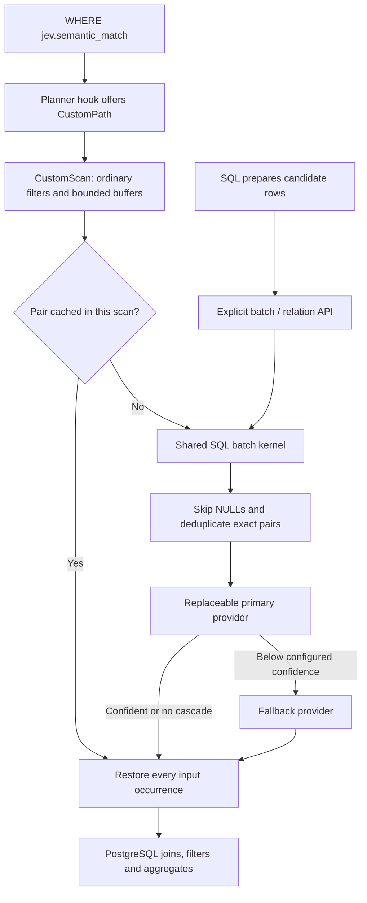
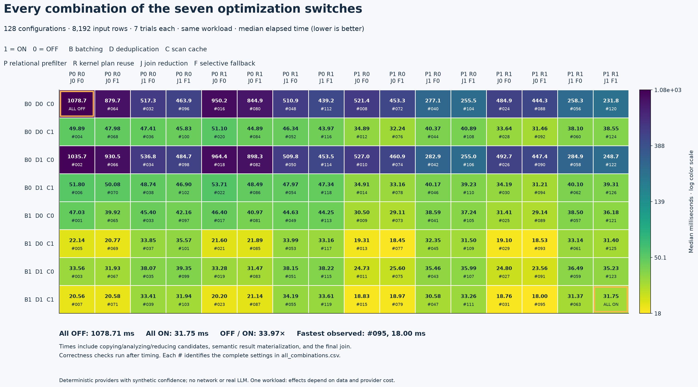

# PostgreSQL JEV extension

**Evaluate semantic predicates in batches, then let PostgreSQL finish the SQL.**

JEV is an experimental PostgreSQL 17 extension that separates relational work
from replaceable model inference. It provides an explicit batch API and opt-in
planner integration through `CustomPath` / `CustomScan`. Current version: **0.4.0**.

The built-in `exact` provider is deterministic text equality for development and
testing. An optional local Ollama adapter evaluates embedding similarity. The
extension does not include a general instruction-following LLM decision model.

[Quick start](#quick-start) · [Design](#how-it-works) · [Switches](#optimization-design-and-onoff-comparisons-040) · [Benchmarks](#measured-performance) · [Detailed reference](docs/reference.md)

## Quick start

### 1. Build and install

Requirements: **PostgreSQL 17**, its server development headers and PGXS, a C
compiler, Make, and Python 3 for provider tests. Other PostgreSQL major versions
are not currently supported. Run these commands from the repository root:

```sh
# Use the pg_config belonging to the PostgreSQL 17 installation you will run.
PG_CONFIG=/path/to/postgresql17/bin/pg_config
make PG_CONFIG="$PG_CONFIG"
make PG_CONFIG="$PG_CONFIG" install
make PG_CONFIG="$PG_CONFIG" check-local
```

Installation may require the PostgreSQL installation owner's permissions.
`check-local` runs as a non-root user and creates/stops its own disposable cluster;
it does not connect to an existing database. On macOS, an installed command-line
toolchain can be selected with `DEVELOPER_DIR=/Library/Developer/CommandLineTools`.

### 2. Evaluate an explicit batch

Connect to a database where you can install extensions, then run:

```sql
CREATE EXTENSION jev;

SELECT * FROM jev.evaluate_batch(
    'exact',
    ARRAY[
        ROW('42', 'winter boot', 'winter boot')::jev.candidate,
        ROW('42', 'winter boot', 'winter boot')::jev.candidate,
        ROW('43', 'summer shoe', 'winter boot')::jev.candidate,
        ROW('99', NULL,          'winter boot')::jev.candidate
    ],
    128
) ORDER BY ordinal;
```

| ordinal | row_id | decision | confidence |
| ---: | --- | --- | ---: |
| 1 | 42 | true | 1 |
| 2 | 42 | true | 1 |
| 3 | 43 | false | 1 |
| 4 | 99 | NULL | NULL |

Four input occurrences produce four output rows. The duplicate pair is evaluated
once, and the NULL pair is never sent to a provider: **two unique pairs, one
provider call**. `ordinal` identifies an occurrence even when `row_id` repeats or
is NULL. No library preload or model service is required for this example.

### 3. Use a semantic predicate in `WHERE`

In the same database:

```sql
LOAD 'jev';
BEGIN;
SET LOCAL jev.enable_custom_scan = on;
SET LOCAL jev.force_custom_scan = on; -- make the demo's execution path explicit

CREATE TEMP TABLE products(id integer, description text);
INSERT INTO products VALUES
    (42, 'winter boot'), (42, 'winter boot'),
    (43, 'summer shoe'), (99, NULL);

EXPLAIN (ANALYZE, COSTS OFF, TIMING OFF)
SELECT * FROM ONLY products
WHERE jev.semantic_match('exact', description, 'winter boot');

SELECT * FROM ONLY products
WHERE jev.semantic_match('exact', description, 'winter boot');
ROLLBACK;
```

The plan contains `JEVSemanticScan`; the query returns both matching occurrences:

| id | description |
| ---: | --- |
| 42 | winter boot |
| 42 | winter boot |

`'exact'` names registered predicate metadata. Replacing it with a registered
model-backed predicate changes the decision rule. `WHERE` retains TRUE decisions
and discards FALSE or NULL, as usual in SQL. `ONLY` makes this demo's single-table,
no-inheritance scan explicit. The complete runnable example is
[examples/demo.sql](examples/demo.sql).

For normal cost comparison, leave `jev.force_custom_scan = off`. Planner hooks
must be loaded **before planning**; unsupported query shapes retain ordinary
PostgreSQL execution. See [scan eligibility and costing](docs/reference.md#stage-2-opt-in-batched-scan).

## How it works



The SQL/PL/pgSQL kernel handles metadata, provider validation and occurrence
restoration. The C module handles planning, buffering, scan caching and execution
counters. An optional **explicit join-tree reducer** can remove rows with no
relational join support before evaluation; the planner does not insert it for you.

| Entry point | Use it for |
| --- | --- |
| `jev.evaluate_batch(predicate, jev.candidate[], batch_size)` | A finite array of `(row_id, left_text, right_text)` occurrences |
| `jev.evaluate_relation(predicate, relation::regclass, batch_size)` | A candidate relation exposing those three text columns, read in bounded input blocks |
| `jev.semantic_match(predicate, left_text, right_text)` | A Boolean SQL predicate; eligible scans can batch its evaluation |
| `jev.reduce_join_tree(relations, edges, root_node)` | Explicit exact semijoin reduction over a tree of inner equijoins |

[Full API contracts and examples](docs/reference.md#stage-1-explicit-batch-api)
include memory boundaries, permissions, provider registration and join reduction.

### Providers stay replaceable

A provider is a SQL-callable function accepting two text arrays, predicate JSON
and model JSON, and returning an ordered `jev.prediction[]` of Boolean decisions
and scores. `jev.models` records provider/configuration/version;
`jev.predicates` records the decision definition and optional fallback policy.

Providers must return consistent per-pair results independent of batch grouping.
They run with the caller's privileges. Malformed results and provider failures
fail the statement. The optional [Ollama provider guide](providers/README.md)
covers installation, model digest checks and a [real-model SQL demo](examples/ollama_demo.sql).
Its score is cosine-derived similarity, **not calibrated decision confidence**.

## Optimization design and on/off comparisons (0.4.0)

All seven switches below default to **ON**. Load the library with `LOAD 'jev'`
to register and inspect them. Planner integration itself defaults to **OFF**.

| Switch | ON | OFF |
| --- | --- | --- |
| `jev.enable_batching` | Group provider inputs and scan buffers | Process one input per chunk/buffer |
| `jev.enable_deduplication` | Evaluate each identical non-NULL pair once per batch | Evaluate each occurrence |
| `jev.enable_result_cache` | Reuse results across buffers within one scan | No scan result-cache allocation |
| `jev.enable_relational_prefilter` | Apply supported ordinary filters before inference | Apply the same filters afterward |
| `jev.reuse_kernel_plan` | Retain the scan-to-kernel SPI plan | Prepare a one-shot plan per dispatch |
| `jev.enable_join_reduction` | Run exact bottom-up/top-down semijoins | Return unreduced private copies |
| `jev.enable_selective_fallback` | Evaluate fallback only for uncertain inputs | Evaluate fallback for all inputs, but retain confident primary decisions |

These switches preserve the decision policy for valid deterministic providers;
they change how much work runs. More work can expose additional provider errors.
The cache and saved plan belong to one scan. Join reduction must be called
explicitly. Disabling selective fallback does **not** disable the fallback model.

```sql
LOAD 'jev';
SHOW jev.enable_batching;
SET jev.enable_batching = off;
-- Run the same query and inspect EXPLAIN (ANALYZE, TIMING OFF).
SET jev.enable_batching = on;
```

Use the [self-contained switch demo](examples/optimization_switches.sql) for
controlled comparisons. The [detailed switch reference](docs/reference.md#optimization-design-and-onoff-comparisons-040)
explains independent cache/deduplication scopes, cursor settings and prepared plans.

## Measured performance

**All 128 switch combinations** were measured on the same 8,192-row workflow,
with seven timed trials per combination: 896 measurements plus 128 warmups.
Every execution returned the same 1,326-row result bag, including duplicates.

| Configuration | Median elapsed time | All-OFF / configuration |
| --- | ---: | ---: |
| All seven OFF | 1,078.714 ms | 1.00× |
| All seven ON | 31.753 ms | 33.97× |
| All ON except join reduction — fastest observed | 17.995 ms | 59.95× |



Measured 2026-10-04 on PostgreSQL 17.10 / Apple M5, using deterministic equality
providers with synthetic confidence. This repeated-input fixture contains 256
distinct pairs. **These are executor measurements, not real-LLM speedups.** All
OFF still uses the JEV scan and private table copies. Reduction cost more than
it saved with this cheap provider; close rankings have overlapping timing ranges.

The [benchmark report](bench/README.md#all-128-switch-combinations-on-one-workload)
records timing boundaries, interactions, environment and reproduction commands.
[Download all 128 configurations and samples](bench/results/factorial-20261004/all_combinations.csv).
[Function-level profiling](bench/PROFILE.md) separates SQL setup, provider and
model-service costs in earlier experiments.

## Implemented and deferred

| Area | Implemented | Deferred |
| --- | --- | --- |
| Evaluation | Batched inputs, exact deduplication, NULL/duplicate restoration, metadata and provider validation | Streaming result delivery; persistent/session/shared inference cache |
| Scan execution | Bounded buffers, ordinary prefilters, bounded per-scan cache, reusable SPI plan, EXPLAIN counters | Reuse across separate scan nodes; parallel inference scheduling |
| Model cascade | One optional confidence-based fallback stage | Confidence calibration; a general LLM decision adapter |
| Planner | Semantic-function detection, CustomPath/CustomScan, simple single-table costing, optional batch-size choice | Provider-calibrated costs, learned selectivity, custom join paths, automatic cost-based join reordering |
| Relational reduction | Explicit tree of inner equijoins, exact semijoins, composite keys, private temporary outputs | Automatic tree discovery, outer/cyclic joins, Bloom-filter acceleration |
| Paper techniques | The mechanisms above and explicit reduction | Learned semantic pruning, semantic Bloom filters, condition indexes and shared-anchor request packing |

This is an experimental subset of the design discussed in
[JEVDB](https://arxiv.org/html/2610.02046v1), not a complete implementation of its
optimizer. A practical next step is to benchmark a representative provider and
dataset before calibrating costs or adding further pruning techniques.

### Semantic and operational boundaries

- **NULLs and duplicates:** one result per input occurrence; NULL text skips
  inference and returns NULL. Reuse is byte-exact, with no text normalization.
- **Reuse:** explicit arrays reuse within one call; relation evaluation reuses
  within each input block; the custom scan can reuse across its own buffers.
  There is no cache shared across independent queries.
- **Memory:** batch size and buffer targets bound input work, not total process
  memory. Explicit arrays and results can materialize; the last buffered row can
  exceed the soft byte target.
- **Scope:** the custom scan supports a narrow single-table SELECT shape.
  Unsupported forms use PostgreSQL's ordinary paths and scalar evaluation.
  Reduction requires an explicit REPEATABLE READ or SERIALIZABLE transaction.
- **External inference:** providers are trusted application code. Keep secrets
  outside publicly readable metadata. Remote calls are not undone by rollback;
  adapters must control endpoints, timeouts and model/configuration changes.

## Tests and examples

```sh
# Installed extension: upgrades and eleven SQL assertion suites in a fresh cluster.
make PG_CONFIG=/path/to/postgresql17/bin/pg_config check-local

# Provider protocol tests use the standard library; no model download.
python3 -m unittest discover -s test -p 'provider*.py'

# Optional SQL adapter integration, with PostgreSQL 17's PL/Python installed.
JEV_TEST_SQL_PROVIDER=1 make PG_CONFIG=/path/to/postgresql17/bin/pg_config check-local
```

The live-model test is opt-in. SQL coverage includes duplicate/NULL restoration,
provider errors, permissions/RLS, upgrades, caching, cursors, planner choices,
switch combinations and exact join-result equivalence. A
[PostgreSQL 17/Linux CI workflow](.github/workflows/test.yml) runs the build and
isolated integration tests.

| Learn or inspect | Start here |
| --- | --- |
| Full SQL API and settings | [Detailed reference](docs/reference.md) |
| Basic SQL and expected behavior | [Basic demo](examples/demo.sql) |
| Batch/cache behavior | [Batching](examples/batching_demo.sql), [cache](examples/cache_demo.sql) |
| Cascade and relational reduction | [Fallback](examples/cascade_demo.sql), [join tree](examples/join_tree_demo.sql) |
| Planner decisions | [Cost model](examples/cost_demo.sql), [automatic batch sizing](examples/auto_batch_demo.sql) |
| Performance and attribution | [Benchmarks](bench/README.md), [profiling](bench/PROFILE.md) |
| Kernel / planner implementation | [SQL](sql/jev--0.4.0.sql), [C](src/jev_planner.c) |
| Optional real model adapter | [Provider guide](providers/README.md) |

For an existing installation, run `ALTER EXTENSION jev UPDATE TO '0.4.0';` after
installing the files. Upgrades from 0.1.0–0.3.0 are supplied. Reconnect sessions
after replacing a loaded C library. See [build and upgrade details](docs/reference.md#build-and-test).
