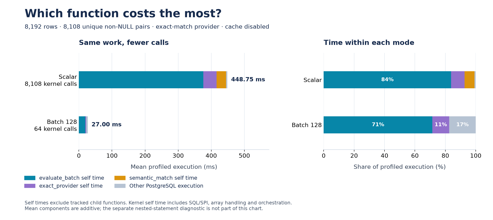
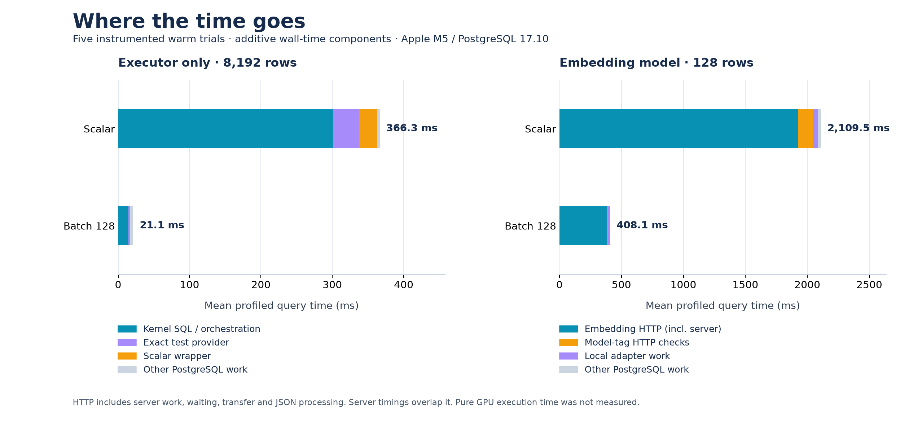

# Why batching is faster: measured profile

## Current 0.2.0 setup profile — 2026-10-04

**`jev.evaluate_batch()` is the largest extension-function cost by aggregate
self time.** It consumes 376.25 ms (83.84%) of the scalar query and 19.29 ms
(71.46%) of the batch128 query in the instrumented means below. This is SQL
orchestration, validation, array handling and result restoration as well as setup;
it is not all removable fixed overhead.



This run profiles the current installed 0.2.0 build after automatic batch sizing
was added. It deliberately fixes the batch size at 128 and disables result
caching, using 8,192 source rows with 8,108 unique non-NULL input pairs and the
exact-match provider. The result contains 2,027 matching rows. No external model
is involved, so model waiting and GPU work cannot explain this improvement.

### Which function is slowest?

Mean milliseconds per complete query across seven instrumented trials:

| Function/component | Scalar self time | Batch128 self time | Scalar → batch calls |
| --- | ---: | ---: | ---: |
| `jev.evaluate_batch` | **376.25** | **19.29** | 8,108 → 64 |
| `jev.exact_provider` | 39.66 | 3.00 | 8,108 → 64 |
| `jev.semantic_match` | 28.92 | 0 | 8,108 → 0 |
| Other PostgreSQL execution (residual) | 3.92 | 4.71 | — |
| **Mean profiled total** | **448.75** | **27.00** | |

Self time excludes tracked child functions. A wrapper's inclusive total is not
an additional cost: `semantic_match` calls `evaluate_batch`, which calls the
provider. Ranking inclusive totals would hide the actual distribution.
The exact provider's self time includes its own PL/pgSQL and array-building
overhead, so even that column is not pure equality-comparison time.
[PostgreSQL function statistics](https://www.postgresql.org/docs/17/monitoring-stats.html#MONITORING-PG-STAT-USER-FUNCTIONS-VIEW).

Uninstrumented median execution was **424.100 ms scalar versus 21.609 ms batched**.
Instrumented medians were 435.066 and 21.951 ms. Means in the chart are larger
because some trials were slower: instrumented ranges were 421.973–534.787 ms
and 21.400–41.465 ms. Normal ranges were 422.260–483.529 ms and
21.218–40.418 ms. Do not mix these means with earlier benchmark medians or infer
an exact profiling-overhead percentage from this small, variable host sample.

### Inside the kernel

A separate experiment used `pg_stat_statements.track=all` and
`track_planning=on`, with three trials per mode. These timings overlap function
timings and sometimes each other; **do not add them to the preceding table or
sum them as a complete query breakdown**. They rank identifiable inner SQL work.

| Inner SQL operation | Source | Scalar plan + execution | Batch128 plan + execution |
| --- | --- | ---: | ---: |
| Dynamic provider dispatch, including provider work | `EXECUTE provider_statements[stage]` | **62.70 ms** | 2.74 ms |
| Restore occurrences/NULLs, join and order results | Final `RETURN QUERY` | 32.12 ms | **6.08 ms** |
| Resolve provider catalog entry | `pg_proc` / `pg_namespace` query | 31.15 ms | 0.27 ms |
| Resolve predicate/model metadata | `jev.predicates` / `jev.models` query | 23.93 ms | 0.21 ms |
| Deduplicate pairs and build arrays | `SELECT DISTINCT` / `array_agg` | 21.37 ms | 3.40 ms |
| Exact-provider array construction (also inside dispatch) | Provider's `RETURN ARRAY` | 14.05 ms | 2.02 ms |

The dynamic provider SQL was planned **8,108 times scalar versus 64 times
batched**. Its planning component was 60.81 ms versus 2.70 ms. PL/pgSQL
`EXECUTE` does not retain its command plan between calls.
[Dynamic SQL behavior](https://www.postgresql.org/docs/17/plpgsql-statements.html#PLPGSQL-STATEMENTS-EXECUTING-DYN).

That planning time is **not pure planner overhead**: this exact provider is
`IMMUTABLE` and can be evaluated during constant folding of the dynamically
planned call. The dispatch execution phase alone (1.89 ms scalar, 0.037 ms
batched) would consequently understate provider work. The provider-body row
above is nested in dispatch and must not be counted again.
[Function volatility](https://www.postgresql.org/docs/17/xfunc-volatility.html).

The static metadata, catalog, deduplication and restoration statements had
**zero new plans** in these warmed diagnostics, while executing 8,108 times
versus 64 times. Thus batching avoids repeated *execution and invocation*
overhead even when SQL planning is already cached. Parsing, executor setup,
PL/pgSQL checks and loops, array updates and memory management also contribute
to kernel self time; the statement view does not isolate all of those phases.
Planning tracking can itself add overhead, which is why this experiment is
separate from the primary function profile.
[Statement statistics](https://www.postgresql.org/docs/17/pgstatstatements.html).

### Native call-stack observations

Separate five-second macOS samples corroborate distributed interpreter, catalog,
allocation and hashing work. The largest scalar leaf was library `bsearch`
(161 of 3,710 sampled stacks, 4.34%); the largest PostgreSQL leaf was
`SearchCatCacheInternal` (121, 3.26%), followed by `AllocSetAlloc` (112, 3.02%)
and `ExecInterpExpr` (108, 2.91%). No one native leaf explains most of the scalar
time. In batch mode, `hash_bytes` was the largest leaf (346 of 3,795 observations,
9.12%), followed by `ExecInterpExpr` (278, 7.33%).

These are periodic stack observations, including possible waits, not exact CPU
percentages or per-function elapsed milliseconds. The sample windows ran 11
scalar queries versus 182 batched queries, so their raw counts must not be
compared as work per query. The parsed leaf table is included in the repository;
raw stack dumps remain local because they include machine and process paths.

### Implication and reproduction

The next optimization targets are inside the batch kernel: reducing repeated
provider-dispatch planning and general SQL/PL/pgSQL invocation work; for the
already-batched path, reducing the occurrence-restoration SQL and redundant
input deduplication. The C scan already supplies unique misses and restores
source occurrences itself. A narrower internal kernel interface is therefore a
candidate for investigation, while the public API must retain its duplicate/NULL
contract. This profile does not establish the speedup of any proposed change.

```sh
python3 bench/setup_profile.py --output bench/results/my-setup-profile
python3 bench/setup_profile_report.py bench/results/my-setup-profile --no-plot
# With matplotlib installed, omit --no-plot to generate PNG and SVG charts.
```

`setup_profile.py` requires installed PostgreSQL 17, JEV and `pg_stat_statements`.
It creates and restarts only its own disposable instance to preload statistics;
it does not change an existing server. `--no-sampling` skips native sampling.
The report validates SQL call counts against independent function-call counters.

The final run contains 28 normal/function-profile queries, six separate statement
diagnostics, and two native sampling windows. All four scalar/batched and
normal/instrumented full-row bags matched; a separate native equality check
matched too. Calls and output counts agree. All primary timed plans reported
zero shared-block reads. Installed SQL/library/source hashes stayed unchanged,
and the owned database was stopped and removed.

Evidence: [function summary](results/setup-profile-20261004/summary.json),
[nested SQL summary](results/setup-profile-20261004/statement_summary.json),
[native sample summary](results/setup-profile-20261004/native_sample_summary.json).
Adjacent `raw.jsonl`, `statements.json`, `results.json`, `metadata.json` and
`cleanup.json` preserve individual samples, queries, full plans, result hashes
and cleanup verification. Native `stack_*.txt` dumps and the 128-row
`setup-profile-smoke-20261004` harness run remain local; the smoke run is not used
in these reported numbers.

## Historical 0.1.0 profile — 2026-10-03

Profiled on 2026-10-03 using the same Apple M5, PostgreSQL 17.10, Ollama 0.22.0,
and pinned `all-minilm:22m` embedding model as the [performance benchmark](README.md).
No installed extension or production-provider code was changed. All profiling
functions and model-registration changes existed only in a disposable database.

The profile identifies two sources of improvement: fewer repeated SQL and request
setup operations, and less repeated embedding work. The effects are measured
together; the experiment does not isolate pure GPU batching throughput.



## Real embedding provider

The 128-row fixtures contain four NULL inputs, leaving 124 actual pair decisions.
Batch 128 collects all occurrences in one buffer.

| Work performed | Scalar, unique | Batch 128, unique | Scalar, repeats | Batch 128, repeats |
|---|---:|---:|---:|---:|
| Batch-kernel invocations | 124 | 1 | 124 | 1 |
| Provider invocations | 124 | 1 | 124 | 1 |
| Embedding HTTP requests | 124 | 1 | 124 | 1 |
| Model-tag HTTP requests | 248 | 2 | 248 | 2 |
| Evaluated input pairs | 124 | 124 | 124 | 32 |
| Texts sent for embedding | 248 | 125 | 248 | 33 |
| Input tokens reported by service | 2,976 | 2,238 | 2,974 | 582 |

Even the unique-pair case reuses the same right-hand query text. Scalar execution
embeds that query 124 times; a single batch embeds it once. The repeated-pair case
also reuses 92 pair decisions and embeds only 32 distinct descriptions plus the
one common query. These are observed counters, not estimates from row count.

Mean exclusive wall-time components, milliseconds, across five instrumented
queries per configuration:

| Component | Scalar, unique | Batch 128, unique | Scalar, repeats | Batch 128, repeats |
|---|---:|---:|---:|---:|
| Embedding HTTP phase, including server work | 1,925.02 | 384.49 | 2,117.98 | 95.10 |
| Model-tag HTTP checks | 120.85 | 2.22 | 140.72 | 1.72 |
| Local adapter work outside HTTP | 40.38 | 20.56 | 44.99 | 7.01 |
| Remaining PostgreSQL / boundary overhead | 23.22 | 0.79 | 26.93 | 0.55 |
| **Total profiled query time** | **2,109.48** | **408.06** | **2,330.62** | **104.39** |

Components are derived within each query before averaging, so they add to its
elapsed time apart from display rounding. In the unique scalar case, embedding
HTTP occupies about 91% of total time. Local vector validation/normalization is a
subset of local adapter work: 25.19 ms scalar versus 15.22 ms batched. It is not
an additional component to add to the table.

The adapter's own backend-process CPU time averages 114.83 ms scalar versus
27.30 ms batched on unique inputs, far below the elapsed request time. This
measurement excludes CPU/GPU work done in the separate Ollama processes.
A separate Python cProfile diagnostic finds socket `recv_into` as the largest
wall-time entry (1,962.70 ms scalar, 305.65 ms batched). That is a waiting site;
it is not evidence that Python socket code consumes that much CPU.

### Inside the embedding HTTP phase

Ollama reports aggregate server duration of 1,871.68 ms scalar versus 373.28 ms
batched on unique inputs. These values overlap the HTTP measurements above.
Their difference from client HTTP wall time includes transport, response encoding/
decoding, and other work; it is not a separately measured network-latency metric.

The service's reported `load_duration` sums to 961.60 ms across the 124 scalar
requests, versus 9.27 ms for the single batch. In this Ollama version, this field
covers request parsing/validation and runner scheduling through
`checkpointLoaded`. It does **not** establish that model weights were cold-loaded
124 times. The model was already warm. The handler also schedules input texts
concurrently within one embedding request.
[Ollama 0.22.0 handler source](https://github.com/ollama/ollama/blob/v0.22.0/server/routes.go#L642-L797).

Pure GPU execution time is not exposed by this profile. `total_duration` and
`load_duration` are server timing fields in nanoseconds, not GPU profiler results.
[Ollama embedding API](https://docs.ollama.com/api/embed).

## SQL executor without model inference

The exact-provider fixture contains 8,192 rows and 8,108 non-NULL pairs. With
unique inputs, no pair deduplication occurs; batching still helps substantially.

| Measured quantity | Scalar | Batch 128 |
|---|---:|---:|
| `semantic_match` calls | 8,108 | 0 |
| `evaluate_batch` calls | 8,108 | 64 |
| Exact-provider calls | 8,108 | 64 |
| Kernel SQL/orchestration self time | 301.00 ms | 14.60 ms |
| Exact-provider self time | 36.12 ms | 2.36 ms |
| Scalar-wrapper self time | 25.71 ms | 0 ms |
| Unattributed execution overhead | 3.49 ms | 4.12 ms |
| **Total profiled query time** | **366.32 ms** | **21.07 ms** |

The kernel accounts for roughly 82% of scalar query time. Its self time includes
metadata/catalog lookups, SQL/SPI planning and execution, deduplication, array
handling, result restoration, and untracked built-in functions. It excludes the
separately tracked exact provider. The remaining overhead includes scanning,
buffer management, and untracked function-call/GUC setup; it cannot be assigned
solely to the C scan.

A separate 16-row `auto_explain` diagnostic logged 113 statements in scalar mode
and eight in batch mode, including the outer query. Predicate lookup, provider
lookup, deduplication, provider work, and result restoration each occurred 16 times
versus once. Their nested durations overlap, and logging changes performance, so
those timings are not added to the profile tables.

Two separate five-second macOS stack samples also show the expected PL/pgSQL,
SPI, executor and planner call chains. These are periodic stack observations,
including possible waits, not exact CPU percentages or flamegraph self times.
They are retained as `stack_scalar.txt` and `stack_batch_128.txt`.

## Profiling overhead and validation

Five normal and five instrumented trials were interleaved in seeded randomized
order for each of four workloads in both execution modes (80 measured queries total).
Both unique and duplicate fixtures were measured in scalar and batch-128 modes.
All 16 full-row validation combinations returned identical bags within their
workload. Timed output counts, plan types, function-call counts, provider counters,
and additive timing identities passed checks. Both owned services stopped cleanly.

| Workload/mode | Normal median | Instrumented median |
|---|---:|---:|
| Exact, unique, scalar | 363.705 ms | 366.968 ms |
| Exact, unique, batch 128 | 21.136 ms | 20.900 ms |
| Exact, repeats, scalar | 380.866 ms | 412.543 ms |
| Exact, repeats, batch 128 | 14.212 ms | 14.419 ms |
| Embeddings, unique, scalar | 2,128.173 ms | 2,097.504 ms |
| Embeddings, unique, batch 128 | 350.290 ms | 408.244 ms |
| Embeddings, repeats, scalar | 2,175.016 ms | 2,205.932 ms |
| Embeddings, repeats, batch 128 | 103.657 ms | 101.577 ms |

Profiler overhead and normal service/host variation are not separately identifiable
from these five samples. In particular, the instrumented unique batch median is
16.5% higher; do not claim profiling is free, or use the instrumented breakdown to
replace normal latency measurements. Normal medians in this run imply 6.08×
(unique) and 20.98× (repeats) live speedups. The previous benchmark's 6.62× and
23.41× are from a different run and remain recorded separately.

## Instrumentation and reproduction

```sh
python3 bench/profile_run.py --output bench/results/my-profile
python3 bench/profile_report.py bench/results/my-profile
```

The second command requires matplotlib; `--no-plot` validates and writes the JSON
summary using only the standard library. The runner requires the same local
dependencies and permissions as the benchmark. `--no-sampling` skips the macOS
stack-sampling diagnostic. A small smoke run can use `--kernel-rows 128
--live-rows 16 --repeats 1 --no-sampling`.

- PostgreSQL `track_functions=all` provides before/after deltas within one explicit
  transaction. Deltas avoid relying on when backend-local pending statistics are
  flushed. Function totals include children; self times exclude tracked children.
  [PostgreSQL statistics documentation](https://www.postgresql.org/docs/17/monitoring-stats.html#MONITORING-PG-STAT-USER-FUNCTIONS-VIEW).
- `profile_adapter.py` embeds the exact production adapter and wraps its request
  and normalization functions with coarse timers. All counters are reset outside
  the measured query. HTTP timing includes JSON processing and all server waiting.
- `time.process_time()` measures only the database backend process. Its nested
  values overlap and are not added together.
- Detailed Python cProfile runs are separate and excluded from the five-trial
  phase means. macOS stack sampling and nested SQL logging are separate too.
- `profile_report.py` validates accounting and builds mean, additive wall-time
  charts. It does not stack independently calculated phase medians.

Raw evidence is in `results/profile-20261003/`: `raw.jsonl`, per-case JSON,
`summary.json`, `*_cprofile.json`, `stack_*.txt`, `nested_*.json`, server logs,
source/model metadata, and verified `cleanup.json`.
