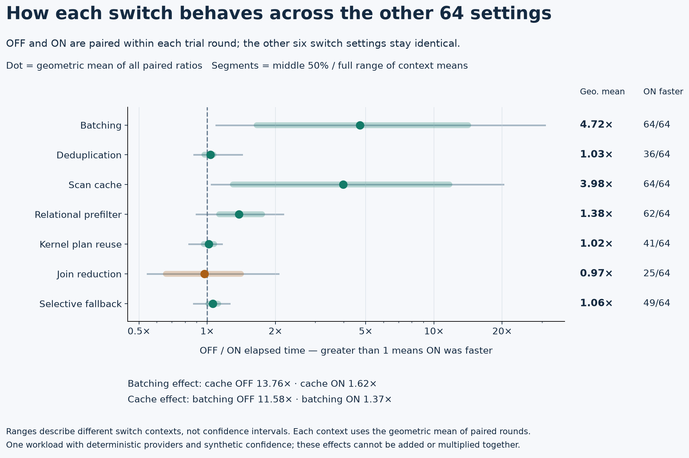
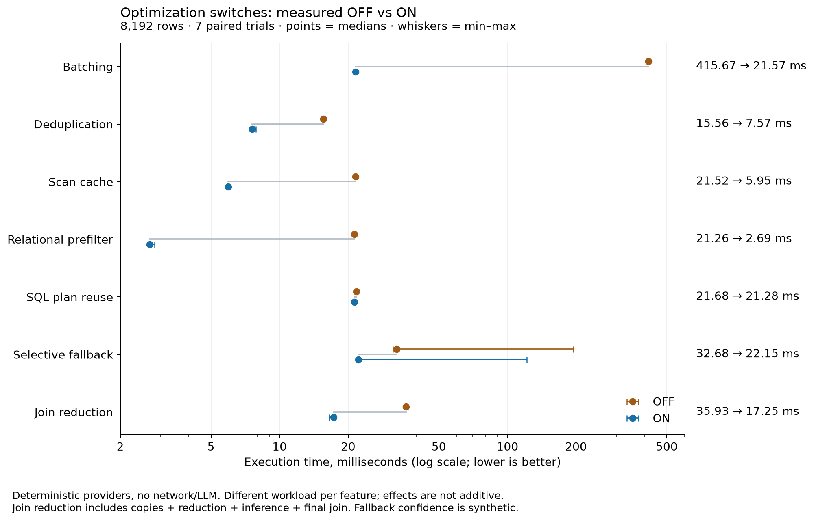

# Local performance benchmark

For measured attribution of SQL, HTTP, server, and Python costs, see
[the performance profile](PROFILE.md). Its current 0.2.0 setup profile ranks
function self times, nested SQL planning/execution, and native stack samples;
the earlier real-model measurements are retained separately.

`run.py` measures the installed extension using a disposable PostgreSQL cluster
and, optionally, a dedicated Ollama service with an already cached model. It does
not download models, connect to an existing database, or change existing services.
The current runner targets this macOS workspace and uses `/private/tmp`.

The repository includes the documented measurement runs, charts and derived
summaries. Runtime logs, native stack dumps and scratch runs remain local;
selected validation logs are included. The join-tree demo's notice uses a
repository-relative source path in place of the original local home directory.
Recorded timings, plans and result counts are unchanged.

```sh
python3 bench/run.py --suite kernel --output bench/results/my-kernel-run
python3 bench/run.py --output bench/results/my-full-run
python3 bench/cache_compare.py --output bench/results/my-cache-comparison
python3 bench/cost_compare.py --output bench/results/my-cost-comparison
python3 bench/auto_batch_compare.py --output bench/results/my-auto-batch-comparison
```

Install the current extension first. The runner verifies that installed SQL and
the installed library match the workspace. Full runs also require `plpython3u`,
Ollama, and cached `all-minilm:22m` weights. Use `--models`, `--model`, or
`--ollama-port` to change the model directory, cached model, or dedicated port.
The output directory must not already exist. Shared memory and local server
sockets may require running outside a restricted sandbox.


## All 128 switch combinations on one workload

`factorial_compare.py` measures the complete 2⁷ grid of the seven optimization
switches introduced in 0.4.0. The planner controls are held fixed: custom scan
forced, automatic batch sizing off, row cap 128, buffer target 64 MB, and cache
budget 4 MB. Batching OFF still changes actual scan/provider batches to one.

```sh
python3 bench/factorial_compare.py --output bench/results/my-factorial-run --rows 8192 --repeats 7
python3 bench/factorial_report.py bench/results/my-factorial-run
```

The first command uses only Python's standard library and a matching installed
extension. The second needs matplotlib for figures; `--no-plots` generates the
analysis and CSV without it. The measurement runner requires a new output
directory; reporting can be repeated over saved measurements.

Every configuration executes the same workflow:


The fixture contains 8,192 B rows, 256 distinct non-NULL text pairs, adjacent
repeats and repeats across buffers, NULL texts/keys/business IDs, and duplicate
source rows. Half the rows pass the ordinary filter and half have complete join
support. These selections correlate with pair groups, making the fixture useful
for observing reuse interactions, not representative of every workload. Primary
and fallback decisions use deterministic byte equality. Primary confidence is a
synthetic 0.2 for pair keys divisible by ten and 0.99 otherwise; cutoff is 0.9.

Each of 128 configurations receives one warmup, then seven complete rounds run
in independently shuffled, recorded order. Every trial verifies the full result
bag after timing and checks the selected scan, captured switches, batch size,
cache-off behavior and reducer cardinality. The server timer includes private
copies, ANALYZE, reduction passes, semantic `EXPLAIN ANALYZE`/CTAS and final join
materialization. It excludes fixture creation, GUC changes, BEGIN/ROLLBACK,
validation and catalog VACUUM between rounds. Common EXPLAIN overhead is included.
All switches OFF remains a custom-scan/materialization workflow, not native SQL.

Feature effects pair OFF and ON within each round while holding the other six
switches fixed. The report geometrically averages these ratios across all 64
contexts and seven rounds. Observed ranges describe variation across contexts,
not confidence intervals. Close observed rankings can be indistinguishable
within timing variability. Per-stage medians need not sum to the total median.
No real-model performance or quality conclusion follows from these providers.

### Complete factorial results, measured 2026-10-04

PostgreSQL 17.10 on the local Apple M5: 896 timed executions plus 128 warmups.
All 1,024 executions returned the same 1,326-row result bag, including duplicate
multiplicity and NULL values. Installed SQL/library hashes matched the workspace
and stayed unchanged; the disposable server was stopped after the run.

| Configuration | Median ms | Observed min–max ms | All-OFF median / median |
| --- | ---: | ---: | ---: |
| All seven OFF | 1,078.714 | 964.279–1,217.393 | 1.00× |
| All seven ON | 31.753 | 29.513–37.137 | 33.97× |
| All ON except join reduction (fastest observed, #095) | 17.995 | 17.137–20.614 | 59.95× |


The matrix covers all 128 settings. Each cell is the median of seven trials;
the configuration number maps to a row in the CSV. Yellow indicates lower time.
All OFF remains the same JEV pipeline, including its private table copies.

The fastest observed configuration sent 128 inputs through four kernel calls.
All ON reduced those to 64 inputs through two calls, but the reduction/copy/ANALYZE
stage grew from 13.367 to 27.355 ms while the semantic stage fell only from 3.346
to 2.708 ms (stage medians). Extra relational reduction therefore cost more than
it saved here. This is specific to cheap providers and this repeated-input
fixture; several of the fastest configurations have overlapping timing ranges.



Batching and scan caching both reduced elapsed time in all 64 matched contexts
when comparing each context's geometric mean of seven round-paired ratios.
Their effects overlap: batching's average OFF/ON ratio was 13.76× with caching
OFF, versus 1.62× with caching ON. Conversely, caching averaged 11.58× with
batching OFF and 1.37× with batching ON. These are geometric means of matched
ratios, distinct from the endpoint ratios of medians in the table.

Deduplication and kernel-plan reuse averaged only 1.03× and 1.02× across the
whole grid. Those small aggregate differences are descriptive, not evidence of
statistical significance. The slowest normalized round was about 8.5% above
per-configuration medians; individual outliers and all samples remain in the
saved data. No timings were discarded.

[All 128 configurations and samples (CSV)](results/factorial-20261004/all_combinations.csv),
[derived comparisons](results/factorial-20261004/analysis.json),
[raw timings and plans](results/factorial-20261004/raw.jsonl),
[warmups](results/factorial-20261004/warmup.jsonl),
[environment and hashes](results/factorial-20261004/metadata.json),
[cleanup](results/factorial-20261004/cleanup.json).


## Version 0.4.0 optimization switches, measured 2026-10-04

Run `python3 bench/switch_compare.py --output bench/results/my-switch-run --rows 8192 --repeats 7` after building/installing 0.4.0. The runner creates/stops its own PostgreSQL instance, uses no network model, and verifies source/build hashes. See [switch design and usage](../README.md#optimization-design-and-onoff-comparisons-040) and [runnable SQL](../examples/optimization_switches.sql).

Each experiment changes one switch only; order is randomized within each of seven paired rounds. Full scan result bags and fallback outputs are checked before timing; reduction checks result counts and sorted-bag checksums against native equality on every run. Fixtures have 8,192 semantic rows. Scan workloads use unique pairs, nearby repeats, interleaved repeats, or a 10% relational filter according to the feature. Do not add or multiply the speedups: workloads and optimization interactions differ.

| Switch | OFF median ms | ON median ms | OFF / ON | OFF range ms | ON range ms |
| --- | ---: | ---: | ---: | --- | --- |
| `jev.enable_batching` | 415.674 | 21.571 | 19.27× | 413.028–417.190 | 21.378–22.028 |
| `jev.enable_deduplication` | 15.561 | 7.573 | 2.05× | 15.438–15.661 | 7.490–7.864 |
| `jev.enable_result_cache` | 21.518 | 5.954 | 3.61× | 21.378–22.022 | 5.901–6.069 |
| `jev.enable_relational_prefilter` | 21.261 | 2.690 | 7.90× | 21.033–21.367 | 2.652–2.827 |
| `jev.reuse_kernel_plan` | 21.684 | 21.276 | 1.02× | 21.554–21.857 | 21.190–21.438 |
| `jev.enable_selective_fallback` | 32.677 | 22.153 | 1.48× | 31.482–194.652 | 21.677–121.437 |
| `jev.enable_join_reduction` | 35.933 | 17.255 | 2.08× | 35.310–36.260 | 16.527–17.600 |



Batching kept 8,108 non-NULL inputs while reducing kernel calls from 8,108 to 64. Nearby-repeat deduplication reduced kernel inputs from 8,108 to 1,064 (some pairs straddle buffers); the interleaved-repeat cache reduced inputs to 1,024. Prefiltering reduced input work to 812 pairs. Join reduction reduced its B source from 8,192 to 819 rows (811 non-NULL pairs) while retaining the complete final result bag. Both reducer modes include private materialization and initial ANALYZE; ON adds semijoin passes and their ANALYZE work. The measured workflow includes inference/final join but excludes transaction cleanup and fixture creation.

Selective fallback uses a fabricated confidence pattern and deterministic equality fallback. Expected fallback inputs are 8,192 OFF versus 819 ON; these counts follow the fixture/policy, rather than remote-provider telemetry. Its times varied widely (OFF 31–195 ms, ON 22–121 ms), so the median ratio is exploratory. No real-model cost, throughput, or answer-quality benefit is established. SQL-plan reuse showed only a small local difference.

[Raw timings/plans](results/switches-20261004/raw.jsonl), [summary](results/switches-20261004/summary.json), [environment and source hashes](results/switches-20261004/metadata.json). Render the figure with `python3 bench/switch_report.py bench/results/switches-20261004` (requires matplotlib).

## Method for the original batch-size sweep

- PostgreSQL 17.10; one persistent client/backend; no concurrent benchmark queries.
- Warm every execution variant with an untimed query and compare full result-row
  bags, including duplicate IDs. Every timed plan also checks output row count.
- Measure `EXPLAIN (ANALYZE, FORMAT JSON, TIMING OFF, SUMMARY ON, BUFFERS ON)`
  execution time; save planning time separately. Client transfer of result rows,
  database setup, model loading, and warmups are excluded from the main metric.
- Five seeded, randomized rounds for the exact-provider executor tests; three
  for live embeddings. Report medians and observed ranges, not confidence intervals.
- Compare native byte-exact equality, scalar `semantic_match`, and forced batched
  CustomScan with buffers of 1, 16, 128, and 512 occurrences. Live tests stop at 128.
  Each timed custom plan must explicitly report `Semantic Evaluation: batched`.
- JIT and parallel scan workers disabled; shared buffers 128 MB; scan buffer soft
  target 1 MB; synchronized scans disabled. No indexes. Tables are analyzed.
  `fsync=off` is used only for the disposable cluster; timed queries are read-only.
- All warmups and measurements use the same immutable boolean `active` filter.
  Selective fixtures retain blocks of four rows to preserve positive/negative mix.
- The duplicate fixtures have the same logical rows in nearby versus interleaved
  insertion layouts. Physical scan order and resulting reuse are measured, not
  assumed. NULL inputs bypass inference. The original benchmark keeps cross-buffer
  caching disabled; pass `--result-cache-kb 4096` to enable it on version 0.2.0.

The exact provider is a deterministic equality test, so this suite measures the
extension's SQL, metadata, deduplication, buffering, and dispatch overhead. Native
equality is a reference floor, not an alternative implementation of AI semantics.
The live suite measures the complete local embedding adapter, including SQL,
HTTP, model-digest checks, embedding execution, and cosine calculation. It is not
an isolated model-kernel benchmark or a Jev decision-model evaluation.

## Version 0.2.0 automatic batch sizing on 2026-10-04

`auto_batch_compare.py` compares scalar SQL, the existing fixed-size custom-path
offer, and the new `jev.auto_batch_size` option. Every custom path is unforced;
PostgreSQL can choose an ordinary scan or index in both fixed and automatic
modes. Both use a maximum of 128 rows and a 1 MB soft buffer target, with retained
result caching disabled. The analyzed, indexed table has 8,192 source rows and
8,108 unique non-NULL pairs. No external model runs.

Seven seeded randomized rounds for six queries and three modes produce 126
timed executions. Each mode is warmed and validated first. Full scans and index
lookups compare full bags against native equality; unordered LIMIT queries
check the requested count and qualifying occurrences without assuming identity
or ordering. Measurements use one backend, with JIT/parallel workers disabled.

Local Apple M5 / PostgreSQL 17.10 median execution times:

| Query | Fixed mode | Automatic sizing | Automatic choice |
| --- | ---: | ---: | --- |
| Full scan | 9.457 ms | 9.600 ms | Batch 128 |
| LIMIT 1 | 0.044 ms | 0.044 ms | Native Seq Scan |
| LIMIT 4 | 0.134 ms | 0.065 ms | Batch 8 |
| LIMIT 16 | 0.175 ms | 0.069 ms | Batch 16 |
| LIMIT 64 | 0.166 ms | 0.149 ms | Batch 32 |
| Indexed one-row lookup | 0.042 ms | 0.043 ms | Native Index Scan |

LIMIT 16 becomes **2.54× faster than fixed mode** in this workload. Both make
one kernel call, but fixed128 evaluates 127 non-NULL pairs before returning 16
rows, while automatic16 evaluates only 16. Its observed range is 0.068–0.075 ms
versus 0.169–0.179 ms for fixed mode. LIMIT 4 changes from an ordinary scalar
scan to batch8 and becomes 2.06× faster. For LIMIT 64, automatic32 evaluates 64
pairs in two calls instead of 127 pairs in one: this is the overhead/extra-work
tradeoff the alternatives expose. Its timing ranges overlap, so this small
median difference should not be treated as a reliable speedup.

Full scans select the same batch128 strategy and report identical work counters
(8,108 pairs, 64 kernel calls). Their timing ranges overlap. Automatic sizing
does introduce planning work: median planning time was 0.020 ms versus 0.010 ms
for LIMIT 16, and 0.018 ms versus 0.008 ms for LIMIT 1. The table shows execution
time only; tiny queries can lose overall time from extra planning. This is why
the feature is opt-in. These warm local measurements are not real-model latency
estimates, and comparison with earlier runs on this host is not controlled.

The [recorded results](results/auto-batch-20261004/summary.json) contain all modes,
samples, selected sizes, counters and validation hashes. Adjacent `raw.jsonl`
stores all plans; `metadata.json` verifies unchanged source/build identities;
`validation.log` records the passing nine-suite run and optional provider tests;
`endpoint-validation.log` includes the final 65,536-row planning-cap assertion.
`cleanup.json` verifies that the owned database stopped and was removed.
The [SQL demo](../examples/auto_batch_demo.sql) was executed separately, with
[saved output](results/auto-batch-demo-20261004/auto_batch_demo.txt).

## Version 0.2.0 cost selection on 2026-10-04

The new `cost_compare.py` measures ordinary scalar execution, automatic path
selection, and forced batching. Five rounds randomize these three modes for
each of three queries: 45 timed executions. One persistent backend uses an
analyzed 8,192-row table with an ordinary id index. Batches contain at most 128
rows and the cross-buffer cache is disabled. All non-NULL pairs in the final run
are unique, so no deduplication or cache saving explains the difference.
The deterministic exact provider is used; no external model runs.

Measured on Apple M5 / PostgreSQL 17.10, medians in milliseconds:

| Query | Scalar | Automatic | Forced batch | Automatic choice |
| --- | ---: | ---: | ---: | --- |
| Full scan | 422.939 | 18.027 | 17.489 | JEVSemanticScan |
| Indexed lookup, one row | 0.091 | 0.088 | 0.508 | Index Scan |
| First matching row, LIMIT 1 | 0.084 | 0.091 | 0.318 | Seq Scan |

Automatic batching makes this full scan **23.46× faster than scalar JEV**.
Both evaluate 8,108 unique non-NULL pairs; scalar JEV enters `evaluate_batch`
once per pair while the custom scan dispatches 64 kernel calls. Those calls
share metadata lookup, provider validation and SQL dispatch work. Repeated
inference setup can also be shared by real providers, but this run measures SQL
and extension overhead only. Native equality is used to validate results; the
speedup is not relative to native PostgreSQL equality.

The small-result queries show the other side: forcing a heap batch loses the
index's selective access, or evaluates 127 non-NULL pairs before LIMIT returns
one row. Automatic mode keeps the native path in both cases. Its tiny timing
differences from scalar mode are not evidence of a meaningful speedup.

These are warm, single-client observations, not a latency guarantee. Full-scan
automatic samples ranged 17.399–18.310 ms versus scalar 419.415–425.590 ms.
Planner costs are heuristic: both plans retain PostgreSQL's 2,731 estimated
output rows although the actual result has 8,108 rows. The model exposes this
error rather than learning semantic selectivity from one execution.

Each mode was warmed and its full result bag checked against native equality;
LIMIT validates one qualifying occurrence since there is no ORDER BY. Every
timed query checked its output count. Source and installed-build hashes were
verified before and after the run, and the owned database was stopped and removed.
`--duplicates 2` can exercise in-buffer reuse separately (the default is 1).

The [final results](results/cost-model-unique-20261004/summary.json) include every
sample, representative plans and validation hashes. Adjacent `raw.jsonl`,
`metadata.json`, `validation.log` and `cleanup.json` retain complete evidence.
The earlier `cost-model-20261004` attempt stopped at a forced-path assertion;
`cost-model-final-20261004` is a successful repeated-pair exploratory run. Neither
supplies the unique-pair measurements above.

The [SQL demo](../examples/cost_demo.sql) was also executed. Its
[saved output](results/cost-demo-20261004/cost_demo.txt) shows automatic batching,
index and LIMIT alternatives, and an intentionally high declared batch-call cost
switching the full scan back to a native path. The high cost is a planning
experiment, not a measured change in the provider.

## Version 0.2.0 cache measurements on 2026-10-04

`cache_compare.py` compares cache budgets 0 and 4096 kB with batch size fixed at
128. Each round randomizes the order of the two settings in the same backend;
seven rounds per workload produce 56 measured queries. Each configuration is
warmed and its full result bag checked against native equality before timing.
This isolates cache effects in the updated executor; it is not a comparison with
the 0.1.0 implementation and uses no external model.

Measured on the same Apple M5 / PostgreSQL 17.10 setup:

| Workload (8,192 source rows) | Cache off median | Cache on median | Evaluated pairs off → on | Kernel calls off → on |
|---|---:|---:|---:|---:|
| Unique inputs | 21.398 ms | 22.954 ms | 8,108 → 8,108 | 64 → 64 |
| Nearby repeated inputs | 8.549 ms | 9.213 ms | 1,064 → 1,024 | 64 → 64 |
| Interleaved repeated inputs | 21.568 ms | 6.027 ms | 8,108 → 1,024 | 64 → 16 |
| Unique inputs, relational filter keeps ~10% | 2.687 ms | 2.874 ms | 812 → 812 | 7 → 7 |

Interleaved repeats become 3.58× faster, with 7,084 cache hits. Unique inputs are
7.3% slower because cache lookup/storage adds work without eliminating inference.
Nearby duplicates already benefit from per-buffer deduplication; a cache has
little additional work to remove, and that workload's measured range is wider.
Use the exposed cache budget to disable retention when reuse is unlikely.
These measurements do not estimate LLM latency, cost, or semantic accuracy.

[Paired results](results/optimization-paired-20261004/summary.json) include all
samples, ranges and counters; adjacent `raw.jsonl`, `metadata.json`,
`validation.log` and `cleanup.json` retain plans, hashes, the passing test log and
verified shutdown. The earlier separate `optimization-cache-off-20261004` and
`optimization-cache-on-20261004` sweeps are exploratory: their later phases showed
host timing drift, so the paired run supplies the comparison above.

The executable demos' actual output is saved in `results/optimization-demos-20261004/`:
cache reuse evaluates 32 distinct pairs instead of 256 and dispatches four kernel
calls instead of 32; the cascade demo falls back only on one uncertain unique
pair; exact relational reduction reduces B from ten rows to five, evaluates three
unique non-NULL pairs, and preserves the final nine-row result bag.

## Version 0.1.0 measured on 2026-10-03

Machine: MacBook Air, Apple M5 (10 CPU cores), 32 GB unified memory. Ollama 0.22.0
used its Metal backend. Model: `all-minilm:22m`, 384 dimensions, digest
`1b226e2802dbb772b5fc32a58f103ca1804ef7501331012de126ab22f67475ef`.

The final measurements are in `results/20261003-final/`. Preliminary `smoke` and
`main` directories are not used in the reported results: the selective fixture
and result-bag validation were corrected before the final run.

Median execution time, with batch size 128:

| Workload | Table rows | Scalar | Batched | Scalar/batched |
|---|---:|---:|---:|---:|
| Exact provider, unique inputs | 8,192 | 374.535 ms | 21.836 ms | 17.15× |
| Exact provider, nearby duplicates | 8,192 | 368.608 ms | 14.325 ms | 25.73× |
| Exact provider, spread-out duplicates | 8,192 | 372.913 ms | 22.131 ms | 16.85× |
| Exact provider, ordinary filter keeps ~10% | 8,192 | 38.170 ms | 2.792 ms | 13.67× |
| Embeddings, unique inputs | 128 | 2,571.780 ms | 388.617 ms | 6.62× |
| Embeddings, nearby duplicates | 128 | 2,094.997 ms | 89.505 ms | 23.41× |
| Embeddings, ordinary filter keeps 25% | 128 | 547.790 ms | 86.985 ms | 6.30× |

Observed timing ranges (minimum–maximum, milliseconds):

| Workload | Scalar range | Batch-128 range |
|---|---:|---:|
| Exact, unique | 372.721–404.024 | 21.453–22.275 |
| Exact, nearby duplicates | 366.552–383.799 | 14.030–14.854 |
| Exact, spread-out duplicates | 364.047–393.448 | 21.768–22.727 |
| Exact, filter keeps ~10% | 37.279–38.671 | 2.639–2.946 |
| Embeddings, unique | 2,346.964–3,058.500 | 364.236–408.670 |
| Embeddings, nearby duplicates | 2,092.484–2,099.193 | 81.354–90.945 |
| Embeddings, filter keeps 25% | 543.172–584.265 | 80.909–106.435 |

## What the measurements establish

Batching matters independently of deduplication: the unique exact-provider case
goes from 374.535 ms scalar to 21.836 ms at batch 128, despite reusing zero pairs.
Batch 1 is slower than scalar (430.218 ms), so introducing a CustomScan alone does
not deliver the improvement. Native equality takes 0.658 ms on that same fixture;
these results do not justify using semantic evaluation for ordinary equality.

Increasing exact-provider batch size from 16 to 128 to 512 yields 46.045, 21.836,
and 18.368 ms respectively on unique inputs. The largest tested buffer is fastest
here, but this is not a general optimal batch-size claim.

Duplicate placement exposes the cache boundary. Both duplicate layouts contain
1,024 global distinct non-NULL pairs. At batch 128, nearby duplicates require
1,064 pair evaluations and reuse 7,044 occurrences; spread-out duplicates require
8,108 evaluations and reuse none. Both make 64 provider calls and return identical
result bags. The extra 40 evaluations in the nearby layout are repeated pairs
across actual buffer boundaries. Query-wide reuse remains unimplemented.
An independent untimed scan-order probe reproduced all three batched uniqueness
counts in Python. Heap placement perturbed the clustered insertion order; the
extra evaluations are not a counter discrepancy. Its evidence is saved in
`results/layout-probe/probe.json`.

Ordinary filtering reduces exact-provider candidates from 8,192 to 820, non-NULL
inputs from 8,108 to 812, and batch-128 dispatches from 64 to 7. All 8,192 heap rows
are still read. The scalar baseline also applies this cheap filter first; the
filtering benefit is not exclusive to CustomScan.

In the 128-row live cases, four NULL inputs skip inference. Batch 128 reduces
124 singleton provider dispatches to one. Nearby repeats reduce evaluated pairs
from 124 to 32. Each current provider invocation makes one embedding request and
two model-tag checks; its own text deduplication also reuses the shared query text.
The observed speedup combines all of these effects, not GPU batching alone.

All 36 warmed mode/workload combinations returned matching full-row bags, and all
156 timed executions had the expected output count and plan type. Every timed
plan reported zero shared-block reads; these are warm, memory-resident workloads.
The process was not isolated from other applications, and the live run has only
three samples per variant. No cold-start, concurrency, large-table, dollar-cost,
semantic-quality, or paper-reproduction claim is made.

`Peak Buffered Bytes` is partial executor accounting, not process RSS. Observed
buffers reached their requested row limits when enough candidates existed; the
1 MB target did not truncate this sweep. The final run verified that both owned
services stopped, and deleted its temporary database.

## Outputs

- `summary.json`: all per-workload medians, ranges, samples, counters, and validation hashes.
- `raw.jsonl`: every measured query and complete JSON plan.
- `metadata.json`: versions, arguments, source hashes, and model digest.
- `cleanup.json`: owned-service shutdown verification.
- `hardware.json`, `http_accounting.json`: local hardware and an independent check
  of observed HTTP counts against the expected warmup/trial dispatch counts.
- `postgres.log`, `ollama.log`, `psql.log`: server/client diagnostics.
- `performance.png`, `performance.svg`: chart of the main comparison, generated by
  `python3 bench/plot.py bench/results/20261003-final` with matplotlib installed.
