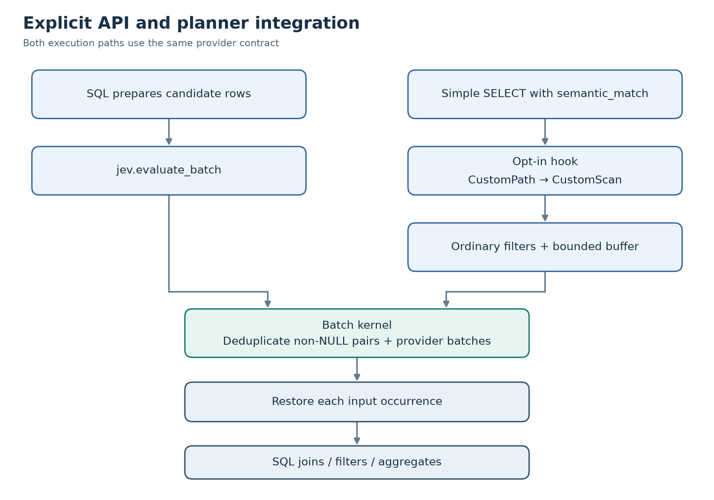
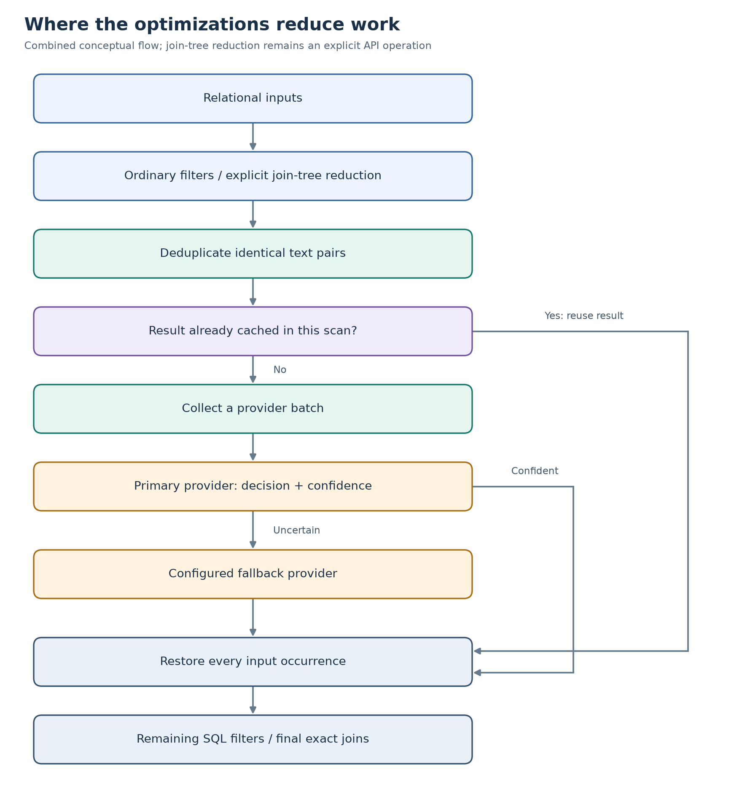
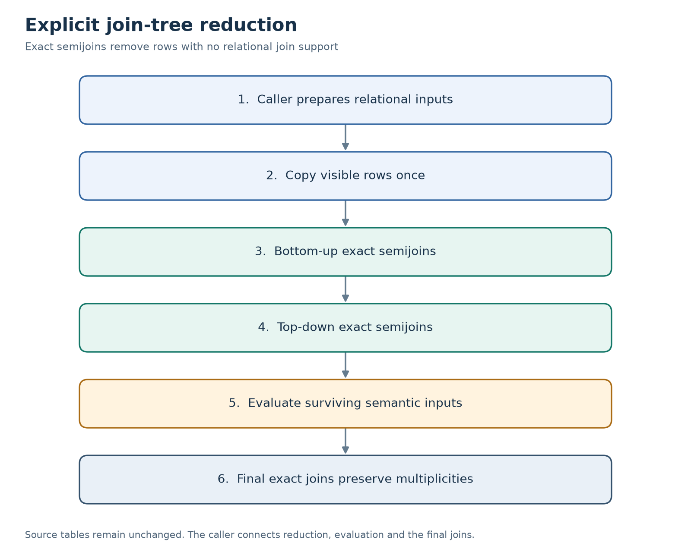

# PostgreSQL JEV extension: detailed reference

[Project overview and quick start](../README.md) · [Benchmarks](../bench/README.md)

A deliberately small implementation of the batch-evaluator design, version 0.4.0.
The supported build target is **PostgreSQL 17**. The deterministic `exact`
predicate is a test provider, not an AI model or semantic-similarity algorithm.

| Stage | Implemented | Deferred |
| --- | --- | --- |
| Explicit evaluation | Predicate/model metadata, replaceable SQL providers, exact deduplication, selective batched fallback, bounded input blocks from candidate relations, occurrence-preserving output | Persistent cache, automatic confidence calibration, streaming result delivery |
| Planner integration | Bounded batched `CustomScan`, relational prefilters, bounded result reuse across scan buffers, reusable SPI plan, execution counters, simple single-table cost selection and optional planner-selected batch sizes; scalar fallback for complex predicates | Reuse across distinct scan nodes, provider-specific cost calibration, custom join paths, learned pruning, selectivity learning, automatic cost-based join reordering |
| Relational reduction | Reusable explicit join-tree API with bottom-up/top-down exact semijoins, composite keys, private temporary outputs and before/after counts | Join-tree discovery, automatic reduction planning, outer/cyclic joins and semantic Bloom filters |
| Real inference | Optional local Ollama embedding-similarity provider with a pinned model digest and validation | Instruction-following LLM decisions and confidence calibration |



[Scalable SVG](diagrams/api-paths.svg) · [Diagram source](diagrams/api-paths.mmd)

The explicit API and batched scan use the same kernel and provider contract.
The scan evaluates simple semantic filters in bounded buffers; complex predicate
shapes retain scalar evaluation. An opt-in cost model compares batch work and
first-buffer startup against ordinary PostgreSQL paths. Its configurable costs
are initial assumptions, not measured provider latency or a speedup guarantee.

The batch kernel is SQL/PL/pgSQL; only planner/executor integration is C. This
keeps model adapters independent of PostgreSQL's planner internals.

## Optimization design and on/off comparisons (0.4.0)



[Scalable SVG](diagrams/optimizations.svg) · [Diagram source](diagrams/optimizations.mmd)

Reduction changes which rows reach inference; deduplication/cache change how
often a pair is evaluated; batching and saved plans reduce call setup work.
Selective fallback avoids secondary model work for confident decisions.
The diagram combines mechanisms from the explicit and custom-scan APIs; the
planner does not automatically connect a join reducer to a scan.

The following independent session switches default to **on**. They preserve
the result policy for valid, deterministic providers while allowing one-at-a-time
performance experiments. `LOAD 'jev'` registers them for `SHOW` and validation.
The SQL-only API also accepts these four switches before LOAD: batching,
deduplication, selective fallback, and join reduction; unset values default on.

| Switch | ON | OFF |
| --- | --- | --- |
| `jev.enable_batching` | Group inputs up to the configured cap | Provider chunks of one; custom-scan buffers of one |
| `jev.enable_deduplication` | Evaluate identical non-NULL pairs once per batch | Evaluate each non-NULL occurrence; restore results by ordinal |
| `jev.enable_result_cache` | Reuse earlier-buffer decisions within one scan | Allocate no result-cache arena; keep the configured budget unchanged |
| `jev.enable_relational_prefilter` | Apply ordinary immutable quals before inference | Apply those same quals after semantic evaluation |
| `jev.enable_join_reduction` | Execute bottom-up/top-down semijoins | Return unreduced private copies; still validate/copy/analyze inputs |
| `jev.enable_selective_fallback` | Send only uncertain primary inputs to fallback | Send all inputs to fallback, but adopt only the uncertain inputs' fallback results |
| `jev.reuse_kernel_plan` | Prepare/retain the scan-to-kernel SQL plan once | Prepare a one-shot plan per kernel dispatch |

Turning off selective fallback does **not** disable the fallback model or change
the confidence threshold. It deliberately does redundant fallback work, then
retains confident primary answers. A primary-only experiment is a different
quality policy and needs separate accuracy evaluation. Errors from even discarded
fallback answers still fail the query. Likewise, disabling prefiltering/reduction
can expose previously skipped inputs to provider errors and additional inference.
Permissions, NULL handling, result validation and snapshot checks stay enabled.

The result-cache switch affects `CustomScan` only. It is independent of
deduplication: disable both to eliminate both forms of reuse. Join reduction is
an explicit API operation, so its switch does not alter ordinary PostgreSQL join
planning. `reuse_kernel_plan` controls the outer C-to-SQL SPI plan only; it does
not remove dynamic provider-statement planning inside the PL/pgSQL kernel.

```sql
LOAD 'jev';
BEGIN;
SET LOCAL jev.enable_custom_scan = on;
SET LOCAL jev.force_custom_scan = on; -- hold the access path fixed
SET LOCAL jev.auto_batch_size = off;
SET LOCAL jev.enable_result_cache = off; -- isolate deduplication

SET LOCAL jev.enable_deduplication = off;
EXPLAIN (ANALYZE, TIMING OFF)
SELECT * FROM ONLY products WHERE jev.semantic_match('exact', description, 'boots');

SET LOCAL jev.enable_deduplication = on;
EXPLAIN (ANALYZE, TIMING OFF)
SELECT * FROM ONLY products WHERE jev.semantic_match('exact', description, 'boots');
ROLLBACK;
```

Use the [self-contained switch demo](../examples/optimization_switches.sql) without
application tables. `EXPLAIN` shows captured switch values, kernel input counts,
calls and cache hits. `Kernel Inputs` can include duplicates with deduplication
off; `Unique Inputs` remains a legacy alias. Captured Boolean switch changes
during an open batched cursor are rejected; close/reopen it for another mode.
Prepared statements can retain earlier cost choices: use `DISCARD PLANS` before
comparing planner selection under changed settings.

Existing planner controls remain separate: `enable_custom_scan=off` uses native
PostgreSQL paths; `force_custom_scan=on` bypasses path competition;
`auto_batch_size=off` uses the fixed cap. No switch is added for features that
are not implemented, such as shared-anchor requests, SBFs or condition indexes.

The [paired benchmark](../bench/switch_compare.py) validates output equivalence,
randomizes ON/OFF order in each round, and records time plus work counters for
all seven switches. It includes copying, reduction, inference and the final
join in the reduction measurement. See [method and results](../bench/README.md).

## Build and test

Install PostgreSQL 17 and its server development headers, a C compiler, and Make.

```sh
make PG_CONFIG=/path/to/postgresql17/bin/pg_config
make PG_CONFIG=/path/to/postgresql17/bin/pg_config install
make PG_CONFIG=/path/to/postgresql17/bin/pg_config check-local
```

`install` copies extension files into that PostgreSQL installation and may need
the installation owner's permissions. `check-local` uses a fresh temporary
cluster, a private Unix socket, and no TCP listener. It does not connect to an
existing database. Run it as a non-root user. Failed test artifacts are retained;
set `JEV_KEEP_TEST_DATA=1` to keep successful runs too. The GitHub workflow builds
and runs the same tests on PostgreSQL 17/Linux.

Local 0.2.0 validation: compilation, upgrade plus nine SQL suites, and the optional
fake-service SQL provider integration passed with PostgreSQL 17.10 on macOS arm64.
The Python run passed 11 tests and skipped the opt-in live-model test. SQL coverage
includes batching, cascade selection/errors, scan-cache limits and role changes,
duplicate/NULL preservation, metadata/permissions, RLS before relation inference,
prepared statements, cursors, unforced cost-based path and batch-size choices, and exact semijoin bag equivalence. All three new
optimization demos were executed. The Linux CI workflow is supplied but has not
been run from this workspace.

Local 0.3.0 validation additionally covers fresh installation, chained upgrades,
and ten SQL suites, including branching/composite-key reduction, every root,
exact result-bag comparison, supported key types, partitioned/materialized
sources, permissions/RLS and temporary-table cleanup. The executable API demo
produced A: 6→3, B: 10→5, C: 6→3 and the same nine final result rows. See its
[recorded output](../bench/results/join-tree-20261004/demo.txt). These are fixture
counts, not a throughput benchmark; the provider remains deterministic equality.

Version 0.4.0 adds SQL and C optimization switches. Local validation passed all
eleven SQL suites, chained upgrades, and eleven provider tests (one optional live
test skipped). Switch coverage includes 32 executor combinations, SQL-only
operation before LOAD, duplicate/NULL restoration, fallback-policy equivalence,
cursor setting changes and reduction ON/OFF result equivalence.

Version 0.3.0 added the explicit join-tree SQL API without changing the C module.
After installation, upgrade an existing database with
`ALTER EXTENSION jev UPDATE TO '0.4.0';`. Upgrades from 0.1.0 through 0.3.0 are supported.
The cost-model and automatic-sizing additions were C-only changes within 0.2.0.
If replacing an older loaded library, reconnect existing database sessions.

Provider protocol tests use Python's standard library:

```sh
python3 -m unittest discover -s test -p 'provider*.py'
```

With PL/Python 3 installed, include the generated SQL adapter's fake-service
integration test in the disposable database run:

```sh
JEV_TEST_SQL_PROVIDER=1 make check-local
```

The optional live-model test is opt-in; routine tests never download a model.

After installing a changed C module, reconnect existing sessions before using
it. A backend that has already loaded `jev` retains its loaded library.

On macOS, choose an installed developer toolchain if needed, for example
`DEVELOPER_DIR=/Library/Developer/CommandLineTools make ...`.

```sql
CREATE EXTENSION jev;
```

The upgrade retains custom model/predicate metadata; models upgraded from 0.1.0
default to `score_kind='uninterpreted'`, with no cascade enabled.

The SQL batch API needs no preload setting. Planner hooks require `LOAD 'jev'`
in each session before the query is planned (or an administrator-configured
preload setting).

## Stage 1: explicit batch API

```sql
SELECT * FROM jev.evaluate_batch(
    'exact',
    ARRAY[
        ROW('42', 'winter boot', 'winter boot')::jev.candidate,
        ROW('42', 'winter boot', 'winter boot')::jev.candidate,
        ROW(NULL, 'summer shoe', 'winter boot')::jev.candidate,
        ROW('99', NULL, 'winter boot')::jev.candidate
    ],
    128
) ORDER BY ordinal;
```

| ordinal | row_id | decision | confidence |
| ---: | --- | --- | ---: |
| 1 | 42 | true | 1 |
| 2 | 42 | true | 1 |
| 3 | NULL | false | 1 |
| 4 | 99 | NULL | NULL |

`jev.candidate` contains `(row_id text, left_text text, right_text text)`.
`ordinal` is the one-based position in the input array, independent of its lower
bound. Use the ordinal to identify an occurrence: a repeated `row_id` is not a
unique join key. As with other SQL results, request `ORDER BY ordinal` when order
matters.

Prepare finite candidate sets with ordinary relational SQL, then pass an ordered
array. For a semantic join, first construct candidate pairs with normal joins:

```sql
CREATE TEMP TABLE candidates AS
SELECT row_number() OVER (ORDER BY ticket_id, article_id) AS occurrence,
       ticket_id, article_id, question, answer
FROM candidate_pairs; -- application query/view with relational filters applied

WITH input AS (
    SELECT coalesce(array_agg(
        ROW(occurrence::text, question, answer)::jev.candidate
        ORDER BY occurrence
    ), ARRAY[]::jev.candidate[]) AS rows
    FROM candidates
), evaluated AS MATERIALIZED (
    SELECT result.* FROM input
    CROSS JOIN LATERAL jev.evaluate_batch('exact', input.rows, 128) result
)
SELECT c.ticket_id, c.article_id, e.confidence
FROM candidates c JOIN evaluated e ON e.row_id = c.occurrence::text
WHERE e.decision;
```

The kernel materializes the finite input and unique results. `batch_size` limits
the number of unique pairs in a provider invocation; it does not limit the total
memory used by the input array, deduplication, or result. Split very large
candidate sets at the SQL/application boundary. Reuse does not cross such calls.

### NULLs, duplicates, and reuse

- Each input occurrence produces one output row, including repeated and NULL
  row IDs, repeated pairs, and NULL composite candidates.
- If either text is NULL, decision and confidence are NULL and no inference runs
  for that pair. The scalar `semantic_match` is strict and preserves SQL's
  three-valued boolean logic.
- Deduplication uses exact text bytes under `pg_catalog."C"` collation. It does
  not lowercase, trim, normalize Unicode, or infer semantic equivalence.
- Reuse is scoped to one predicate/model metadata snapshot within one function
  invocation. No session, transaction, or persistent inference cache exists.
- Empty input returns no rows; a NULL whole array, invalid batch size, or unknown
  predicate is an error. Arrays must be one-dimensional (empty arrays allowed).

## Replaceable providers and metadata

`jev.models` stores `name`, `version`, `provider` (`regprocedure`), and `config`
(`jsonb`), plus `score_kind`. `jev.predicates` stores `name`, `version`,
`model_name`, `definition` (`jsonb`), and optional `fallback_model_name` and
`min_confidence`. Their owner manages metadata; ordinary callers can read it. Store
credential references, not secrets, in public-readable configuration.

Register a SQL-callable provider with exactly this contract:

```sql
my_schema.my_provider(
    left_texts text[], right_texts text[],
    predicate_definition jsonb, model_config jsonb
) RETURNS jev.prediction[]
```

`jev.prediction` contains `(decision boolean, confidence double precision)`.
Input arrays contain equal numbers of non-NULL texts. Return exactly one
prediction per input pair in the same order. Each prediction must have a
non-NULL decision and finite confidence between 0 and 1. No confidence threshold
is applied unless a cascade is explicitly configured. Invalid provider output fails the SQL statement;
errors are never converted into negative decisions.

```sql
INSERT INTO jev.models(name, version, provider, config)
VALUES ('my-model', 'revision-1',
        'my_schema.my_provider(text[],text[],jsonb,jsonb)'::regprocedure,
        '{"endpoint_ref":"my-service"}');

INSERT INTO jev.predicates(name, version, model_name, definition)
VALUES ('answers-question', 'v1', 'my-model',
        '{"instruction":"Does the right text answer the left question?"}');
```

The provider must be declared `STABLE` or `IMMUTABLE`, return consistent results
for identical inputs/configuration, and not depend on batch position or size.
Provider volatility, argument types, return type, dimensions, count, and values
are validated at runtime. Calls are schema-qualified, with bound arguments, and
run with the caller's privileges. Providers are trusted application code: the
kernel cannot verify their determinism or undo remote side effects. A network
adapter must pin its model/configuration and supply suitable timeout and error
handling. The optional Ollama adapter is installed separately.

Metadata version fields record provenance; this version does not maintain a
model registry, enforce immutable revisions, or key a persistent cache.
`regprocedure` values in metadata do not create dependencies on provider
functions. Dropping or changing a provider will cause validation errors until
metadata is corrected. Replacing a function or updating configuration takes
effect on the next evaluation; there is no old cross-call result cache.

Custom metadata rows are registered for `pg_dump`. The built-in names `exact`
and `exact-v1` are reserved seeds and excluded from that data dump: register
separate names for durable customizations. Restore requires your provider
functions and their implementations to be available.

### Selective fallback

Set both `fallback_model_name` and `min_confidence` on a predicate to enable a
single fallback stage. Both registered models must declare
`score_kind='decision_confidence'`: the score means confidence in the returned
Boolean decision, including a FALSE decision. The allowed other meanings are
`similarity` and the default `uninterpreted`; neither may participate in a cascade.
This declaration is a provider contract, not evidence of statistical calibration.
The built-in exact test model declares decision confidence; the Ollama similarity
provider must not be relabeled as a confidence model to bypass this guard.

```sql
-- Both models must already be registered with decision_confidence scores.
UPDATE jev.predicates
SET fallback_model_name = 'review-model', min_confidence = 0.9
WHERE name = 'answers-question';
```

The kernel deduplicates pairs, calls the primary model in bounded batches, then
compacts only pairs with `confidence < min_confidence` into fallback batches.
Confidence exactly at the threshold remains primary, as does a high-confidence
FALSE. Both providers receive the same predicate definition and their own model
configuration. Fallback predictions are final even if their confidence is low;
there is no recursive escalation. Provider errors fail the statement rather than
triggering fallback. Duplicates and NULLs are restored as in the original API.
Normal provider EXECUTE privileges apply when each provider is invoked; an unused
fallback does not require a call. See the executable
[cascade mechanism demo](../examples/cascade_demo.sql), which uses fabricated scores
and an exact fallback, not an LLM or calibrated confidence estimator.

### Candidate relations and exact join reduction

`jev.evaluate_relation(predicate_name, candidates regclass, batch_size DEFAULT 128)`
accepts a table, partitioned table, view, or materialized view exposing three
`text` columns: `row_id`, `left_text`, and `right_text`. Extra columns are ignored.
Ordinary SELECT/column privileges, view semantics and RLS apply to the cursor.

```sql
CREATE TEMP TABLE semantic_candidates AS
SELECT occurrence_id::text AS row_id, ticket_text AS left_text,
       article_text AS right_text
FROM prepared_join_candidates;

SELECT * FROM jev.evaluate_relation('answers-question', 'semantic_candidates', 128);
```

Each block holds at most `batch_size` input occurrences (1..65536), including
NULLs, and uses `evaluate_batch`. Ordinals are contiguous across blocks, but a
relation has no guaranteed scan order; use distinct occurrence IDs to rejoin
results, since duplicate business IDs are not unique row identifiers. Reuse in
this API is per block, not across blocks. Text width is not bounded, and PL/pgSQL
materializes output in PostgreSQL's tuplestore, which can spill according to
`work_mem`. This is bounded input batching, not streaming result delivery.

### Reusable join-tree reduction (0.3.0)

`jev.reduce_join_tree(relations regclass[], edges jev.join_edge[], root_node DEFAULT 1)`
applies the relational reduction technique in
[JEVDB §3.2.2](https://arxiv.org/html/2610.02046v1#S3.SS2.SSS2)
to an explicitly supplied tree of inner equijoins. It performs exact `EXISTS`
semijoins, rather than the paper's Bloom-filter acceleration. This removes
relationally unsupported rows before inference; it makes no semantic prediction.

```sql
BEGIN ISOLATION LEVEL REPEATABLE READ;

-- A--B--C; node 2 holds the semantic input texts.
CREATE TEMP TABLE reduced AS
SELECT * FROM jev.reduce_join_tree(
    ARRAY['a'::regclass, 'b'::regclass, 'c'::regclass],
    ARRAY[
        ROW(1, ARRAY['a_key'], 2, ARRAY['a_key'])::jev.join_edge,
        ROW(2, ARRAY['c_key'], 3, ARRAY['c_key'])::jev.join_edge
    ],
    2
);

SELECT node, source_relation, reduced_relation, input_rows, retained_rows
FROM reduced ORDER BY node;
-- Use the returned temporary relations for inference and final exact joins.
-- They remain available until COMMIT/ROLLBACK.
ROLLBACK;
```

Each edge contains `(left_node, left_columns, right_node, right_columns)`.
Nodes are one-based **positions**, even if an input array has another lower bound.
Multiple column pairs form an `AND` condition. Edge order and direction are
arbitrary; repeated source relations at distinct nodes support self-joins.
The root determines traversal, not the final result. Bottom-up passes reduce
parents using surviving children; top-down passes reduce children using parents.
The routine does not run providers or materialize the complete join product.



[Scalable SVG](diagrams/join-reduction.svg) · [Diagram source](diagrams/join-reduction.mmd)

The [executable API demo](../examples/join_tree_demo.sql) connects returned relation
names to `evaluate_relation`, restores every occurrence, and verifies the full
result bag against the unreduced query. The earlier
[manual SQL recipe](../examples/relational_reduction.sql) remains available.

| Contract | Behavior |
| --- | --- |
| Graph | 1..64 nodes, exactly N−1 edges, connected; rejects cycles/disconnected graphs |
| Keys | Same built-in type, type modifier and collation at both ends; supports smallint, integer, bigint, text, uuid, date, timestamp, timestamptz, numeric, boolean |
| Equality | Explicit `pg_catalog.=`; ordinary NULL keys never match; redundant key pairs are harmless |
| Sources | Tables, partitioned tables and materialized views; normal inheritance applies; views and foreign tables/descendants are rejected |
| Permissions | Invoker SELECT on all copied columns; source RLS applies; database TEMP privilege required |
| Snapshot | Explicit REPEATABLE READ or SERIALIZABLE transaction required for consistent multi-command materialization |
| Outputs | New temporary tables with all user columns; duplicates retained; `ON COMMIT DROP`; counts reflect rows visible to the caller |

Input tables are never modified. Output copies preserve values/types/collations,
but not source system columns, ordering, indexes, constraints, generated-column
metadata or RLS policies. They are snapshots of rows visible when copied, owned
by the invoking role. Assign a private occurrence ID before mapping inference
results back; duplicate business IDs remain non-unique. Complete final joins
using the declared equalities, including matching collations and casts.

This API supports an explicitly supplied **tree of binary inner-equijoin edges**,
a subset of general acyclic join queries. It does not discover a join tree,
rewrite arbitrary SQL, optimize outer/anti/cyclic joins, or move semantic
predicates across joins. Materialize ordinary source filters before calling it;
do not use reduced copies as substitutes for unrelated queries.

The routine copies every input and analyzes copies before/after reduction to
provide PostgreSQL with statistics. Temporary storage scales with source data;
deleted rows can continue occupying space until cleanup. PostgreSQL chooses the
physical semijoin plans, so no linear-runtime or overall-speedup guarantee is
claimed. Copying and reduction can cost more than they save for a cheap provider
or a join with few dangling rows. Learned semantic pruning, semantic Bloom
filters, condition indexes and automatic cost-based join reordering remain
deferred.

## Stage 2: opt-in batched scan

```sql
LOAD 'jev';
SET jev.enable_custom_scan = on;
SET jev.force_custom_scan = off; -- let PostgreSQL compare estimated costs
SET jev.auto_batch_size = on; -- optional; compare smaller batches too
SET jev.batch_size = 128;
SET jev.batch_memory_kb = 1024;
SET jev.result_cache_kb = 4096; -- default; 0 disables reuse across buffers

EXPLAIN (ANALYZE, TIMING OFF)
SELECT * FROM ONLY products
WHERE jev.semantic_match('exact', description, 'winter boot');
```

The hook recognizes the extension-owned function by OID and offers a custom
path. `jev.enable_custom_scan` and `jev.force_custom_scan` default to off. Normal
mode estimates batch work and leaves PostgreSQL's native paths available.
Force mode routes eligible scans through the custom path without pretending to
guarantee an inference speedup. It remains a development/test switch.

### Simple single-table cost model

The model applies to batch-eligible scans only. It retains PostgreSQL's native
output-row estimate and uses its ordinary-filter selectivity to estimate rows
entering the buffer. The boolean semantic function's selectivity is normally
PostgreSQL's default (about one third); it has not been learned from model results.
No provider is invoked and no JEV predicate/model metadata is read by this cost hook.
Scalar function costing on native paths remains PostgreSQL's normal function
`COST`; it is not automatically calibrated to the registered provider either.

| Input to costing | Source |
| --- | --- |
| Heap pages, ordinary filters, projection work | PostgreSQL's sequential-scan cost routines |
| Candidate count | Table row estimate × ordinary-filter selectivity |
| Effective batch capacity | Smaller of the proposed path's batch size and the approximate capacity under `jev.batch_memory_kb` |
| Buffered width | Full table row width, copied text operands and approximate tuple headers; not just projected columns |
| `jev.batch_call_cost` = 100 | Configurable fixed kernel-call overhead, in `cpu_operator_cost` units |
| `jev.batch_input_cost` = 10 | Configurable kernel/provider work per candidate, in the same units |
| Buffer maintenance | One `cpu_tuple_cost` plus two `cpu_operator_cost` per candidate |

With `N` candidate rows and effective capacity `B`, the additional work is:

```text
estimated calls = ceil(N / B)
batch work = estimated calls × batch_call_cost × cpu_operator_cost
           + N × (batch_input_cost × cpu_operator_cost
                  + cpu_tuple_cost + 2 × cpu_operator_cost)
total cost = heap scan + ordinary filters + projection + batch work
```

The first buffer's share of scanning and batch work is charged to startup, so
`LIMIT 1` can favor an ordinary scan that returns a row immediately. The heap
scan retains PostgreSQL's `enable_seqscan` penalty. An inexpensive index lookup
can also win: the current custom scan still reads the entire heap.

All candidate rows are priced as non-NULL, unique misses. The model does not
assume a cache hit rate merely because a cache is allocated. NULL skips,
duplicates, cache reuse, and fallback frequency can make actual work differ.
Configure input cost to include expected fallback work if using a cascade.
Widths, data distribution and provider batch scaling are approximate. Optional
batch-size selection uses these estimates, without online calibration. Costs
are relative planner units, not milliseconds. These initial defaults have not
been fitted to a real model.
See PostgreSQL's [cost-constant documentation](https://www.postgresql.org/docs/17/runtime-config-query.html#RUNTIME-CONFIG-QUERY-CONSTANTS).

`EXPLAIN` with costs enabled reports the `batch-v1` assumptions, estimated
candidates/calls/buffer width, planned batch settings, batch work, and scalar
sequential-scan baseline cost when the custom path wins. `EXPLAIN ANALYZE` adds
observed work and match counts. Inspect the [cost-selection demo](../examples/cost_demo.sql)
and the [paired measurements](../bench/README.md). Costs for losing custom paths
are not exposed by normal EXPLAIN; force mode is useful for inspecting them.

### Optional automatic batch sizing

`jev.auto_batch_size` defaults to **off**. When enabled with the custom scan,
the planner offers batches of `1, 2, 4, 8, ...` and the exact `jev.batch_size`
limit. At most 17 alternatives are considered, even with the maximum limit of
65,536. Each has the same SQL meaning and output-row estimate; startup time and
the number of kernel calls differ. PostgreSQL compares them with ordinary paths.

```text
Full scan       → larger batches can share more call overhead
Small LIMIT     → smaller batches can reduce work before returning rows
Indexed lookup  → PostgreSQL can still choose its ordinary index scan
```

The extension does not extract LIMIT syntax or stop the scan early itself.
PostgreSQL's normal planner considers row demand, sorting and aggregation above
the scan. This matters for `ORDER BY ... LIMIT`: a sort may need all qualifying
rows. A chosen batch size stays fixed during execution; this is not a runtime
learning algorithm or parallel provider execution. Native paths can still win,
including when batches are expensive or only one row is requested. The selection
uses the [PostgreSQL custom-path interface](https://www.postgresql.org/docs/17/custom-scan-path.html).

`jev.batch_size` is the maximum offered size. `jev.batch_memory_kb` continues to
limit actual buffers using the existing soft byte target. Providers must return
equivalent per-pair decisions regardless of batch grouping, as required by the
existing batching/deduplication contract. `jev.force_custom_scan = on` overrides
automatic sizing and uses the configured fixed size, preserving reproducible
forced comparisons. The [automatic-sizing demo](../examples/auto_batch_demo.sql)
shows fixed versus selected sizes and their actual execution.

`EXPLAIN` reports `Batch Size Selection` (`fixed` or `cost based`) and the actual
`Batch Size`. With costs enabled, `Planned Batch Size` identifies the selected
size and `Planned Batch Size Limit` records the configured cap during planning.
The memory estimate can make `Estimated Batch Rows` smaller than the selected
row limit. Actual counters show whether buffers filled and how much work a
LIMIT query performed before returning its requested rows.
Estimated candidate rows and kernel calls describe the full scan path; a parent
LIMIT may stop it early, so its actual counts can be much lower.

Settings are session-wide, not per predicate. Changing them does not invalidate
an existing generic prepared plan; use `DISCARD PLANS` or prepare again to
reconsider its strategy. An automatically sized plan executes with the smaller
of its chosen size and the current `jev.batch_size`. Raising the cap does not
enlarge a retained plan, and toggling `auto_batch_size` does not rewrite it.
Fixed plans retain the original behavior of using the current configured size.
These settings and the memory/cache limits are read at scan initialization,
not during each FETCH from an open cursor. Planned estimates can therefore differ
from actual work when runtime caps change.

Eligibility is intentionally narrow: a top-level, single-table SELECT over an
ordinary heap table, without row security, inheritance/partition expansion,
row locks, joins, lateral references, or table sampling. Unsupported queries
retain their normal PostgreSQL plans. `ONLY` makes the no-inheritance requirement
explicit. Native executor qualification and projection retain PostgreSQL boolean
logic, duplicates, snapshot visibility, and normal permissions.

Batch mode accepts exactly one positive `semantic_match` filter with a non-NULL
literal predicate name and simple text column/literal inputs. Other filter
clauses must be immutable; volatile projections and additional semantic
expressions use the scalar path. An eligible example is
`WHERE active AND jev.semantic_match('exact', left_text, right_text)`.
OR, NOT, multiple semantic filters, and dynamic predicate names retain scalar
evaluation. The original scalar function's EXECUTE privilege is checked even
when batching replaces its evaluation.

Ordinary filters run before tuples enter a buffer. Each buffer deduplicates
non-NULL pairs. A per-scan result cache also reuses earlier buffers' TRUE and FALSE
decisions, using byte-exact keys. Only misses enter the SQL kernel. NULL inputs
produce no provider work. Occurrence order and duplicates are restored before
projection. Cache contents are private to this scan execution and cleared on
rescan/end; they never cross independent executions, sessions or separate scan nodes.
An open cursor can retain its scan and cache across FETCH statements. Resuming a
batched scan under a different role is rejected before serving buffered/cached
decisions; close and reopen the cursor under the intended role instead.
Previously computed decisions are not retroactively invalidated by provider
privilege changes. Rows materialized by PostgreSQL above this scan follow normal
cursor behavior; this check applies when the JEV scan itself resumes.
No provider result is retained in the reusable SPI execution plan.
SCROLL cursors can use PostgreSQL materialization because the batched scan does
not advertise native backward support.

`jev.result_cache_kb` defaults to 4096. Its arena includes hash buckets, entry
metadata and copied keys; allocator overhead and all other query memory are
additional. Allocation is lazy. Entries that exceed the budget or do not fit are
evaluated without being retained. Existing entries remain until scan reset;
there is no eviction policy. Setting this to zero retains per-buffer deduplication
and the reusable SPI plan while disabling reuse across buffers. The
[cache demo](../examples/cache_demo.sql) repeats 32 pairs across 256 occurrences
with eight-row buffers to demonstrate reuse that per-buffer deduplication misses.

`jev.batch_size` limits buffered candidate rows. `jev.batch_memory_kb` is a soft
target for buffered tuples and text, not a hard process-memory limit: the
last candidate can take a buffer over the target, including one oversized row.
Pointer arrays, hash entries, and executor/kernel/provider allocations require
additional memory. This bounds buffering independently of total table
size. `LIMIT 0` performs no inference; other limits may evaluate the rest of the
current batch before enough output rows are returned. Any provider failure in
that batch fails the statement.

`EXPLAIN ANALYZE` identifies `JEVSemanticScan`, states whether evaluation is
batched or scalar, and reports the batched filter's counters:

| Counter | Meaning |
| --- | --- |
| Rows Read | Heap rows visited |
| Candidate Rows | Rows surviving ordinary filters |
| Evaluated Match Rows / Observed Match Fraction | TRUE occurrences in all filled buffers / fraction of candidate occurrences (including NULLs); may exceed rows delivered under LIMIT. Fraction is absent for zero candidates. |
| Unique Inputs / Reused Inputs | Unique miss pairs sent to the kernel / occurrences answered by cache or duplicate-miss reuse |
| Kernel Calls / Batches | SQL kernel dispatches / nonempty candidate buffers |
| Provider Calls | Legacy alias for Kernel Calls; a cascade can invoke additional providers |
| Cache Hits | Occurrences served from results retained by earlier buffers |
| Cache Entries / Used Bytes / Allocated Bytes | Current admitted entries / occupied arena bytes / allocated arena bytes |
| Cache Admission Skips | Unique miss results not retained because they do not fit; zero when caching is disabled |
| Kernel Time | Measured time in kernel evaluation, including SQL overhead; not pure model inference time |
| Peak Buffered Rows / Bytes | Largest buffered candidate count / tuple-and-input byte accounting |

Work counters accumulate across rescans; peaks are maxima and cache occupancy
describes the current scan pass. Try the reproducible
[batch-size comparison](../examples/batching_demo.sql).

One local run of that 12-row fixture produced the following measured counts
(with cross-buffer caching disabled; these are correctness/dispatch observations,
not a throughput benchmark):

| Batch size | Candidate rows | Unique inputs across buffers | Provider calls | Output rows |
| ---: | ---: | ---: | ---: | ---: |
| 1 | 11 | 9 | 9 | 7 |
| 4 | 11 | 6 | 3 | 7 |

For repeated timing measurements, see the [local performance benchmark](../bench/README.md).
It compares native equality, scalar evaluation, and several custom-scan batch
sizes, with separate executor-only and real Ollama workloads. The report records
the machine, warmup protocol, result checks, timing ranges, and raw-plan locations.

No custom join path is offered and no predicate is moved across a join. Learned
semantic pruning and automatic cost-based join reordering are intentionally absent.

## Optional real provider

[The Ollama adapter](../providers/README.md) installs a separate PL/Python function
implementing the existing provider contract. It sends one multi-text embedding
request per nonempty provider batch and compares pairwise cosine similarity to
a registered threshold. It requires PL/Python 3, a running local Ollama service,
and an already downloaded model with its digest and vector dimension recorded
in model configuration. It never downloads or starts models automatically.

The adapter's `confidence` is `(cosine + 1) / 2`, a similarity score, not a
calibrated probability. Its predicate is text similarity, not arbitrary natural
language instruction following. Model tag/digest checks before and after each
request detect changes, but the service must keep that tag immutable during
queries; the API does not provide an atomic digest-bound inference operation.

[The live SQL demo](../examples/ollama_demo.sql) was exercised locally with
`all-minilm:22m` (384 dimensions, digest
`1b226e2802dbb772b5fc32a58f103ca1804ef7501331012de126ab22f67475ef`).
Its five candidate occurrences became three unique pairs and one provider
dispatch, returning three matching rows including the duplicate. This verifies
the adapter/executor integration, not model quality on an application dataset.

## Implementation notes

- [SQL API and kernel](../sql/jev--0.4.0.sql)
- [Optimization switch upgrade](../sql/jev--0.3.0--0.4.0.sql), [switch assertions](../test/sql/switches.sql)
- [Join-tree reduction and upgrade](../sql/jev--0.2.0--0.3.0.sql), [tree assertions](../test/sql/join_tree.sql)
- [Planner and batch executor](../src/jev_planner.c)
- [Kernel assertions](../test/sql/kernel.sql), [planner assertions](../test/sql/planner.sql), and [batching assertions](../test/sql/batching.sql)
- [Optional Ollama adapter](../providers/README.md)
- [Isolated test runner](../test/run.sh)

The planner code follows PostgreSQL's
[CustomPath interface](https://www.postgresql.org/docs/17/custom-scan-path.html)
and [CustomScan executor callbacks](https://www.postgresql.org/docs/17/custom-scan-execution.html).
Packaging uses [PGXS](https://www.postgresql.org/docs/17/extend-pgxs.html).
PostgreSQL planner internals are version-specific; other major versions are not
claimed as supported until compiled and tested.
